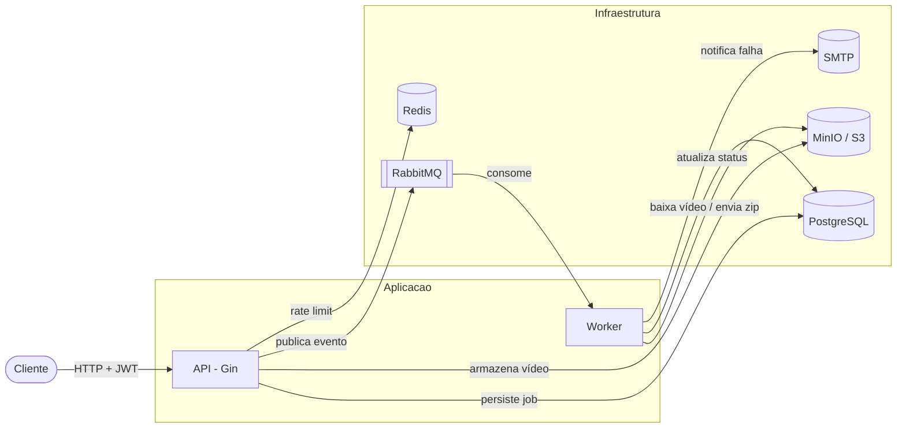
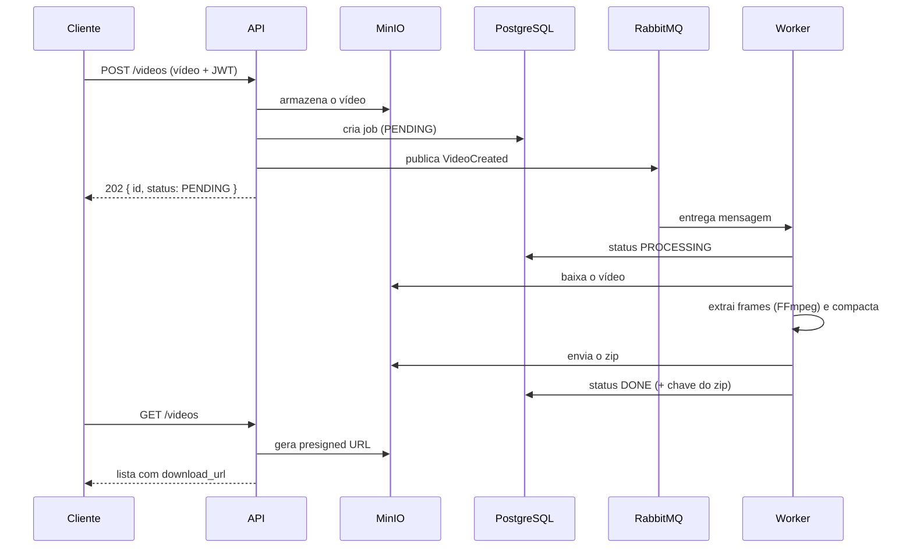

# FIAP X — Sistema de Processamento de Vídeos

Serviço que recebe vídeos, extrai os frames com FFmpeg e devolve um arquivo `.zip`.
Evolução do protótipo síncrono apresentado aos investidores para uma arquitetura
de microsserviços assíncrona, escalável e resiliente.

## Arquitetura

O sistema é dividido em dois processos independentes — uma **API** que recebe as
requisições e um **Worker** que processa os vídeos — desacoplados por uma fila de
mensagens. Isso permite escalar o processamento horizontalmente e absorver picos
sem perder requisições.



### Fluxo assíncrono (sequência)

O upload responde imediatamente com um identificador de job; o processamento
acontece em segundo plano. O cliente acompanha o status por consulta.



## Stack

- **Linguagem:** Go (Clean Architecture)
- **API HTTP:** Gin
- **Mensageria:** RabbitMQ (fila durável, mensagens persistentes, dead-letter queue)
- **Persistência:** PostgreSQL
- **Object storage:** MinIO (compatível com S3)
- **Cache / rate limiting:** Redis
- **Notificação:** SMTP (Mailpit em desenvolvimento)
- **Observabilidade:** Prometheus + Grafana (overlay)
- **Containers:** Docker Compose (base) e Kubernetes (overlay de demonstração)
- **CI/CD:** GitHub Actions

## Como executar

Pré-requisitos: Docker e Docker Compose.

```bash
cp .env.example .env
# gere um segredo e cole em JWT_SECRET:
openssl rand -hex 32

docker compose up --build
```

A subida orquestra a ordem correta: infraestrutura sobe, as migrations rodam,
o MinIO é configurado (bucket + usuário de privilégio mínimo + retenção) e só
então API e Worker iniciam.

Para escalar o processamento:

```bash
docker compose up --build --scale worker=3
```

Interfaces auxiliares: RabbitMQ em `http://localhost:15672`, Mailpit em
`http://localhost:8025`, MinIO em `http://localhost:9001`.

## Endpoints

| Método | Rota             | Autenticação | Descrição                         |
|--------|------------------|--------------|-----------------------------------|
| POST   | `/auth/register` | pública      | Cria um usuário                   |
| POST   | `/auth/login`    | pública      | Retorna um token JWT              |
| POST   | `/videos`        | JWT          | Envia um vídeo (assíncrono)       |
| GET    | `/videos`        | JWT          | Lista os vídeos do usuário        |
| GET    | `/health`        | pública      | Verificação de saúde              |
| GET    | `/metrics`       | pública      | Métricas Prometheus               |

## Requisitos atendidos

| Requisito                                   | Como é atendido                                                        |
|---------------------------------------------|------------------------------------------------------------------------|
| Processar vários vídeos simultaneamente     | Workers concorrentes consumindo a fila; escaláveis via `--scale`       |
| Não perder requisição em pico               | Fila durável + mensagens persistentes + dead-letter queue              |
| Proteção por usuário e senha                | Registro/login com senha em bcrypt e autenticação via JWT              |
| Listagem de status por usuário              | `GET /videos` filtrado por usuário autenticado                         |
| Notificação em caso de erro                 | Notificação por e-mail (SMTP) quando o processamento falha             |
| Persistência de dados                       | PostgreSQL com migrations versionadas                                  |
| Arquitetura escalável                       | Microsserviços desacoplados por mensageria                             |
| Versionamento                               | Git / GitHub                                                           |
| Testes                                      | Testes unitários dos casos de uso e do domínio                         |
| CI/CD                                        | GitHub Actions (formatação, vet, build, testes, build da imagem)       |

## Testes

```bash
go test ./...
```

Os casos de uso recebem suas dependências como interfaces e o relógio é injetado,
o que torna a lógica de negócio testável sem subir nenhuma infraestrutura.

## Estrutura

```
cmd/            Pontos de entrada (api, worker)
internal/
  domain/       Entidades e regras de negócio (máquina de estados)
  usecase/      Casos de uso e portas (interfaces)
  adapters/     Implementações das portas (postgres, rabbitmq, ffmpeg, smtp)
  auth/         JWT e hashing de senha
  httpapi/      Handlers e roteamento HTTP
  middleware/   Autenticação e rate limiting
migrations/     Scripts versionados do banco
deploy/         Configurações de infraestrutura
```
